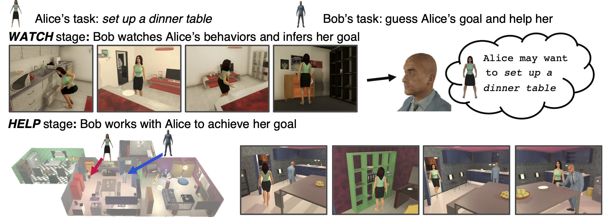

# Watch-And-Help: A Challenge for Social Perception and Human-AI Collaboration

This is the official implementation of the paper [*Watch-And-Help: A Challenge for Social Perception and Human-AI Collaboration*](https://arxiv.org/abs/2010.09890). 

In this work, we introduce Watch-And-Help (WAH), a challenge for testing social intelligence in agents. In WAH, an AI agent needs to help a human-like agent perform a complex household task efficiently. To succeed, the AI agent needs to i) understand the underlying goal of the task by watching a single demonstration of the human-like agent performing the same task (social perception), and ii) coordinate with the human-like agent to solve the task in an unseen environment as fast as possible (human-AI collaboration).



We provide a dataset of tasks to evaluate the challenge, as well as different baselines consisting on learning and planning-based agents.

Check out a video of the work [here](https://youtu.be/lrB4K2i8xPI).

## Cite
If you use this code in your research, please consider citing.

```
@inproceedings{
      puig2021watchandhelp,
      title={Watch-And-Help: A Challenge for Social Perception and Human-{\{}AI{\}} Collaboration},
      author={Xavier Puig and Tianmin Shu and Shuang Li and Zilin Wang and Yuan-Hong Liao and Joshua B. Tenenbaum and Sanja Fidler and Antonio Torralba},
      booktitle={International Conference on Learning Representations},
      year={2021},
      url={https://openreview.net/forum?id=w_7JMpGZRh0}
}
```

## Setup
### Get the VirtualHome Simulator and API
Clone the [VirtualHome API](https://github.com/xavierpuigf/virtualhome.git) repository one folder above this repository

```bash
cd ..
git clone --branch wah https://github.com/xavierpuigf/virtualhome.git
cd virtualhome
pip install -r requirements.txt
```

Download the simulator, and put it in an `executable` folder, one folder above this repository


- [Download](http://virtual-home.org/release/simulator/v2.0/linux_exec.zip) Linux x86-64 version.
- [Download](http://virtual-home.org/release/simulator/v2.0/macos_exec.zip) Mac OS X version.
- [Download](http://virtual-home.org/release/simulator/v2.0/windows_exec.zip) Windows version.


[IMPORTANT] Please make sure to use the [wah](https://github.com/xavierpuigf/virtualhome/tree/wah) branch of the VirtualHome repo and the v2.2.0 version of the executable.

### Install Requirements
```bash
pip install -r requirements.txt
```

### Download Checkpoints
Download the checkpoints for the weights to the hybrid help model and the watching model. Use

```bash
sh scripts/download_ckpts.sh
```


## Dataset
We include a dataset of environments and activities that agents have to perform in them. During the **Watch** phase and the training of the **Help** phase, we use a dataset of 5 environments. When evaluating the **Help** phase, we use a dataset of 2 held out environments.

The **Watch** phase consists of a set of episodes in 5 environments showing Alice performing the task. These episodes were generated using a planner, and they can be downloaded [here](http://virtual-home.org/release/watch_and_help/watch_data.zip). The training and testing split information can be found in `datasets/watch_scenes_split.json`. 

The **Help** phase, contains a set of environments and tasks definitions. You can find the *train* and *test* datasets used in `dataset/train_env_set_help.pik` and `dataset/test_env_set_help.pik`. Note that the *train* environments are independent, whereas the *test* environments match the tasks in the **Watch** test split.


### Create your own dataset 
You can also create your dataset, and modify it to incorporate new tasks. For that, run

```bash
python gen_data/vh_init.py --num-per-apartment {NUM_APT} --task {TASK_NAME}
```
Where `NUM_APT` corresponds to the number of episodes you want for each apartment and task and `TASK_NAME` corresponds to the task name you want to generate, which can be `setup_table`, `clean_table`, `put_fridge`, `prepare_food`, `read_book`, `watch_tv` or `all` to generate all the tasks.

After creating your dataset, you can create the data for the **Watch** phase running the *Alice alone* baseline (see [Evaluate Baselines](#evaluate-baselines)).

You can then generate a dataset of tasks in a new environment where the tasks match those of the **Watch phase**. We do that in our work to make sure that the environment in the **Watch** phase is different than that in the **Help Phase** while having the same task specification. You can do that by running:

```bash
python gen_data/vh_init_gen_test.py
```

It will use the tasks from the test split of the **Watch** phase to create a **Help** dataset.


## Watch
First, download the dataset for the **Watch** phase and put it under `dataset`. 
You can train the goal prediction model for the **Watch** phase as follows:

```bash
sh scripts/train_watch.sh
```

To test the goal prediction model, run:

```bash
sh scripts/test_watch.sh
```

## Help
We provide planning and learning-based agents for the Helping stage. The agents have partial observability in the environment, and plan according to a belief that updates with new observations.


### Train baselines

#### Hybrid Baseline
We train the hybrid baseline in 2 stages. One where we allow the agent to teleport to a location and one where the agent has to walk to the location. You can train the hybrid baseline as follows.

``` bash
# First stage
python training_agents/train_a2c.py \
--max-num-edges 10 --max-episode-length 250 \
--batch_size 32 --obs_type partial --gamma 0.95 \
--lr 1e-4 --nb_episodes 100000 --save-interval 200
--simulator-type unity --base_net TF --log-interval 1 \
--long-log 50 --logging --base-port 8681 
--num-processes 5 --teleport 
--executable_file ../executable/linux_exec_v3.x86_64 \
--agent_type hrl_mcts --num_steps_mcts 24

#Second stage
python training_agents/train_a2c.py  \
--max-num-edges 10 --max-episode-length 250 \
--batch_size 32 --obs_type partial --gamma 0.95 \
--lr 1e-4 --nb_episodes 100000 --save-interval 200 \
--simulator-type unity --base_net TF --log-interval 1 \
--long-log 50 --logging --base-port 8681 \
--num-processes 5 \
--executable_file ../executable/linux_exec_v3.x86_64 \
--agent_type hrl_mcts --num_steps_mcts 50 \
--load-model {path to previous model}

```
### Evaluate baselines
Below is the code to evaluate the different planning-based models. The results will be saved in a folder called `test_results`. Make sure you create it first, one level above this repository. 

```bash
mkdir ../test_results
```

Here is the code to evaluate the baselines proposed in the paper.
```bash
# Alice alone
python testing_agents/test_single_agent.py

# Bob planner true goal
python testing_agents/test_hp.py

# Bob planner predicted goal
python testing_agents/test_hp_pred_goal.py

# Bob planner random goal
python testing_agents/test_hp_random_goal.py

# Bob random actions
python testing_agents/test_random_action.py
```

Below is the code to evaluate the learning-based methods

```bash
# Hybrid Baseline
CUDA_VISIBLE_DEVICES=0 python testing_agents/test_hybrid.py \
--max-num-edges 10 --max-episode-length 250 \
--num-processes 1 \
--agent_type hrl_mcts --num_steps_mcts 40 \
--load-model checkpoints/checkpoint_hybrid.pt

```

## Visualize results
[Coming Soon]
You may want to generate a video to visualize the episode you just generated. Here we include a script to view the episodes you generate during the Help phase.
